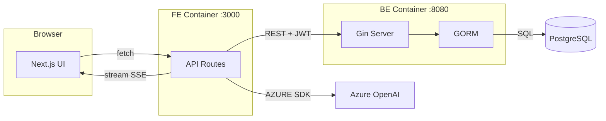

Analyze this repo. Use parallel tool calls aggressively. Argument (subsystem focus if given): $ARGUMENTS

**Step 0: Detect mode from $ARGUMENTS**
- If args start with `f `, `flow `, or equal `f`/`flow` → set FLOW_MODE=true, strip the prefix before processing
- Otherwise FLOW_MODE=false

**Step 0.5: Detect code-graph MCP**
Check if `mcp__code-graph__list_projects` is available:
- If YES → use graph tools for dep tracing (faster, more accurate):
  - `mcp__code-graph__list_projects` → find current repo
  - `mcp__code-graph__get_file_symbols` on entrypoints instead of Grep
  - `mcp__code-graph__get_callers` / `mcp__code-graph__get_callees` to trace critical paths
  - `mcp__code-graph__get_file_imports` instead of grepping imports
  - If repo not indexed yet → call `mcp__code-graph__reindex_repo` first
- If NO → fall back to Glob/Grep sequence below

**Sequence (fallback if no graph):**

1. Glob root for: `package.json`, `go.mod`, `Cargo.toml`, `pyproject.toml`, `requirements*.txt`, `Makefile`, `Dockerfile`, `*.yaml`, `*.toml` — identify stack
2. Read root configs. Locate entrypoints: `main.*`, `index.*`, `app.*`, `cmd/`, `src/`, `bin/`
3. Grep `import|require|from` on entrypoints to trace 2–3 critical dep paths
4. Find env: `.env*`, `config/`, `settings.*`, `*secret*` — list key vars only
5. Extract commands from `scripts`, `Makefile`, CI files (`.github/workflows/`, `ci.yml`)

**Output (always):**

```
STACK:    <lang + runtime + version>
ENTRY:    <file:line — main execution path>
BUILD:    <command>
RUN:      <command>
TEST:     <command>
ENV:      <KEY=source, KEY=source>
DEP FLOW: <A → B → C> (critical path only, 2–3 chains)
GOTCHAS:  <non-obvious config, ordering requirements, known traps>
```

**If FLOW_MODE=true — append a Mermaid diagram after the output block:**

Rules for the diagram:
- Use `graph LR` (left→right) for service/data flow; use `graph TD` for call hierarchies
- Group by layer: Browser / FE / API Routes / Backend Services / External / DB
- Show only the critical request paths (3–5 flows max) — not every file
- Label edges with the protocol or data type: `-->|REST / JWT|`, `-->|SSE stream|`, `-->|SQL|`
- Use subgraphs to cluster services that run in the same process/container
- Keep node names short (≤20 chars), use IDs for linking

Example shape:


No prose. No section headers outside the blocks. If $ARGUMENTS (after stripping f/flow prefix) targets a subsystem, scope all steps to that path.
