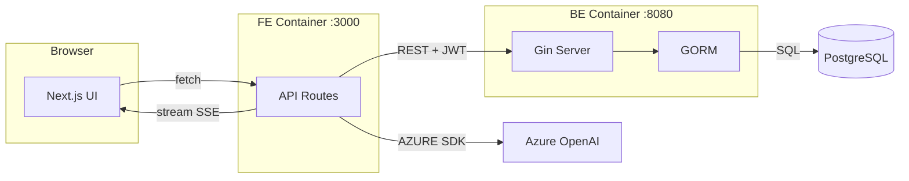

Analyze this repo. Use parallel tool calls aggressively. Argument (subsystem focus if given): $ARGUMENTS

**Step 0: Detect mode from $ARGUMENTS**
- If args start with `f `, `flow `, or equal `f`/`flow` → set FLOW_MODE=true, strip the prefix before processing
- Otherwise FLOW_MODE=false

**Step 0.5: Detect graph backend (priority order)**

**[PRIORITY 1] .graph-agent local SQLite index**
Check if `.graph-agent/index.db` exists in the repo root (run: `test -f .graph-agent/index.db && echo EXISTS`):
- If EXISTS → use `sqlite3 .graph-agent/index.db` for all dep tracing. Schema:
  - `files(id, path, language, checksum)` — all indexed source files
  - `symbols(id, file_id, name, kind, line_start, line_end, parent)` — kind: function|method|struct|class|interface
  - `edges(id, kind, src_file_id, src_symbol, dst_file_path, dst_symbol, line)` — kind: CALLS|IMPORTS
  - `meta(key, value)` — e.g. `repo_root` key
  
  Use these SQL patterns:
  ```sql
  -- Get repo root
  SELECT value FROM meta WHERE key='repo_root';

  -- Find entrypoint files
  SELECT path, language FROM files
  WHERE path LIKE '%main%' OR path LIKE '%index%' OR path LIKE '%app%'
  ORDER BY length(path) ASC LIMIT 15;

  -- Get all symbols in a file
  SELECT name, kind, line_start, parent FROM symbols s
  JOIN files f ON s.file_id = f.id
  WHERE f.path = '<relative/path>';

  -- Trace callers of a symbol (who calls X?)
  SELECT e.src_symbol, f.path AS src_file, e.line
  FROM edges e JOIN files f ON e.src_file_id = f.id
  WHERE e.dst_symbol = '<symbol_name>' AND e.kind = 'CALLS'
  LIMIT 10;

  -- Trace callees of a symbol (what does X call?)
  SELECT e.dst_symbol, e.dst_file_path, e.line
  FROM edges e JOIN files f ON e.src_file_id = f.id
  WHERE e.src_symbol = '<symbol_name>' AND e.kind = 'CALLS'
  LIMIT 10;

  -- Trace imports of a file
  SELECT e.dst_file_path FROM edges e
  JOIN files f ON e.src_file_id = f.id
  WHERE f.path = '<relative/path>' AND e.kind = 'IMPORTS'
  LIMIT 20;

  -- Find files by subsystem/path prefix (for scoped analysis)
  SELECT path, language FROM files WHERE path LIKE '<subsystem>%';

  -- Critical dep chain: top-called symbols
  SELECT dst_symbol, count(*) AS call_count FROM edges
  WHERE kind='CALLS' GROUP BY dst_symbol ORDER BY call_count DESC LIMIT 10;
  ```
  Run queries in parallel. Use results instead of Grep/Glob for symbol and dep tracing.

**[PRIORITY 2] MCP code-graph**
If `.graph-agent/index.db` does NOT exist, check if `mcp__code-graph__list_projects` is available:
- If YES → use graph tools:
  - `mcp__code-graph__list_projects` → find current repo
  - `mcp__code-graph__get_file_symbols` on entrypoints instead of Grep
  - `mcp__code-graph__get_callers` / `mcp__code-graph__get_callees` to trace critical paths
  - `mcp__code-graph__get_file_imports` instead of grepping imports
  - If repo not indexed yet → call `mcp__code-graph__reindex_repo` first

**[PRIORITY 3] Fallback — Glob/Grep sequence (no graph available):**

1. Glob root for: `package.json`, `go.mod`, `Cargo.toml`, `pyproject.toml`, `requirements*.txt`, `Makefile`, `Dockerfile`, `*.yaml`, `*.toml` — identify stack
2. Read root configs. Locate entrypoints: `main.*`, `index.*`, `app.*`, `cmd/`, `src/`, `bin/`
3. Grep `import|require|from` on entrypoints to trace 2–3 critical dep paths
4. Find env: `.env*`, `config/`, `settings.*`, `*secret*` — list key vars only
5. Extract commands from `scripts`, `Makefile`, CI files (`.github/workflows/`, `ci.yml`)

**Output (always):**

```
STACK:    <lang + runtime + version>
ENTRY:    <file:line — main execution path>
BUILD:    <command>
RUN:      <command>
TEST:     <command>
ENV:      <KEY=source, KEY=source>
DEP FLOW: <A → B → C> (critical path only, 2–3 chains)
GOTCHAS:  <non-obvious config, ordering requirements, known traps>
```

**If FLOW_MODE=true — append a Mermaid diagram after the output block:**

Rules for the diagram:
- Use `graph LR` (left→right) for service/data flow; use `graph TD` for call hierarchies
- Group by layer: Browser / FE / API Routes / Backend Services / External / DB
- Show only the critical request paths (3–5 flows max) — not every file
- Label edges with the protocol or data type: `-->|REST / JWT|`, `-->|SSE stream|`, `-->|SQL|`
- Use subgraphs to cluster services that run in the same process/container
- Keep node names short (≤20 chars), use IDs for linking

Example shape:


No prose. No section headers outside the blocks. If $ARGUMENTS (after stripping f/flow prefix) targets a subsystem, scope all steps to that path.
